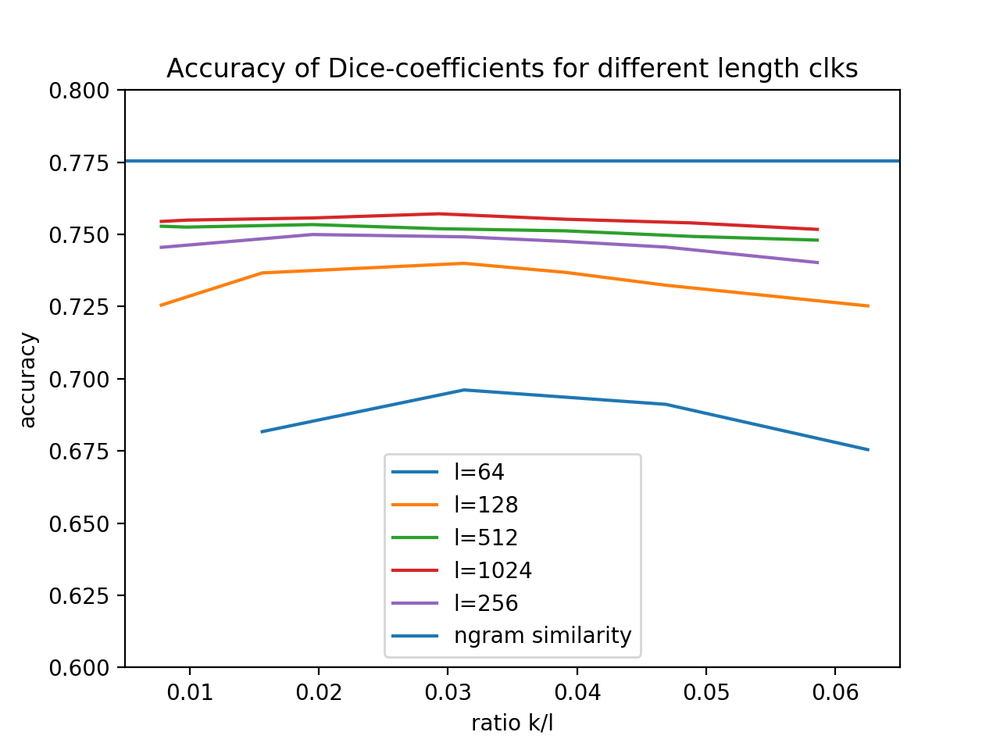
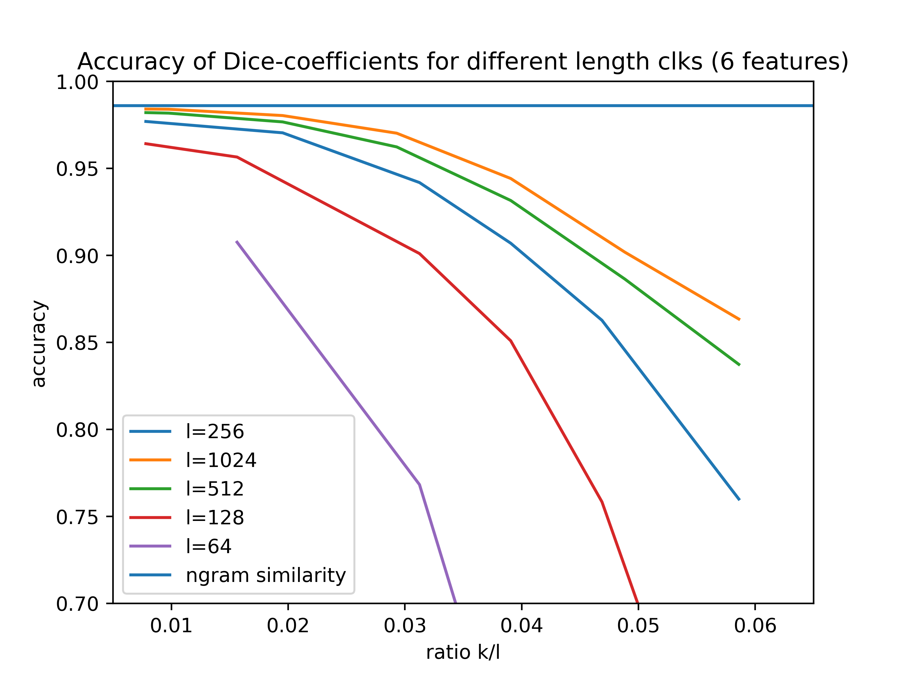

.. _research:

Research Notes
==============

On the length of a CLK
----------------------

.. note::
   This research note was authored by Wilko Henecka and first published on Apr 3, 2018 at https://github.com/data61/clkhash/issues/81

In literature, the length of a CLK ``l`` is either fixed to 1000 or 100. Depending on who is writing the paper. I read somewhere (unfortunately I cannot find it again...) that 100 is just as good as 1000.
That made me suspicious. There should be some difference. But the more interesting question is, what is a good length for a CLK?

Only one way to find out... experiments!

I generated 100000 PII record pairs with the febrl tool (with the default perturbations).
By accuracy in this context I mean: is the similarity score of the correct pair higher than all the other similarity score with the remaining entries in the dataset.
The line for n-gram similarity is a upper bound. That's computed by generating the n-grams and computing the Dice coefficient directly from the n-grams.
Essentially, if you wouldn't have any collisions in a Bloom filter, then it would compute exactly the same.

First experiment with the first three features: firstname, lastname, street number.

and second experiment with 6 features: firstname, lastname, street number, address_1, address_2, dob

Discussion
----------

As expected, there is a difference between the result for different choices of `l`. Interestingly though,  it seems that you get diminished returns when increasing the bloom filter size `l`.

The step from 64 to 128 is more significant than the one from 512 to 1024.

There is a slight decrease in accuracy for small values of `k/l`. This is most likely explained by the higher impact of collisions. Let's say you encode every n-gram with exactly one bit, then, in case of an collision, you cannot differentiate between the two different n-grams any more.

We can see a significant drop-off in accuracy for higher values of the `k/l` ratio. This is due to the fact, that the Bloom filter gets saturated for higher `k`, that is, the overwhelming majority of bits is set to 1.

Conclusion
----------

These experiments suggests, that a good choice for `k` and `l` depend on the number of n-grams that have to be encoded in the Bloom filter.
`k` should be chosen such that, in expectation, somewhere about half the bits in the filter will be set, in order to achieve good accuracy. However, `k` should also not be a small single digit number, thus in this case, `l` should be increased.

The most promising approach to allow the use of small Bloom filters with good accuracy is to control the number of n-grams per entity (think of SOUNDEX encoding of strings, or geo-encoding of addresses).

**However**, this is not very helpful in terms of privacy. As shown in 'Who Is 1011011111...1110110010? Automated Cryptanalysis of Bloom Filter Encryptions of Databases with Several Personal Identifier' and similar publications, the success of attacks on Bloom filters appears to be inverse proportional to the information embedded.
